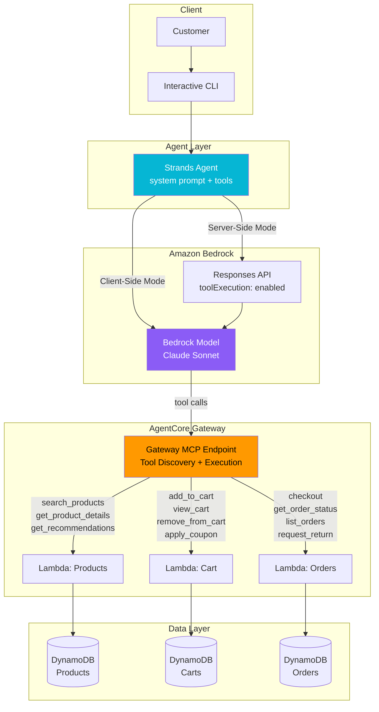

# ShopAssist: E-Commerce Agent Demo

> **Strands Agents SDK + Bedrock Server-Side Tool Execution + AgentCore Gateway**

An AI-powered e-commerce shopping assistant that demonstrates three AWS technologies working together:

1. **[Strands Agents SDK](https://strandsagents.com)** — Open-source agent framework with `@tool` decorators
2. **[Amazon Bedrock Server-Side Tool Execution](https://aws.amazon.com/about-aws/whats-new/2026/02/amazon-bedrock-server-side-tool-execution-agentcore-gateway/)** — Execute tools server-side via Responses API (no client orchestration loop)
3. **[Amazon Bedrock AgentCore Gateway](https://docs.aws.amazon.com/bedrock-agentcore/latest/devguide/gateway.html)** — Managed MCP endpoint that turns Lambda functions into agent tools

## Architecture



## Three Execution Modes

### Mode 1: Local (Strands Agent + @tool functions)

```
Customer → Strands Agent → Bedrock Model → tool_use → local Python function
```

For development and testing. No infrastructure needed.

### Mode 2: Client-Side (Strands Agent + MCP Client → Gateway)

```
Customer → Strands Agent → Bedrock Model → returns tool_use
                ↓ (client executes)
           MCP Client → AgentCore Gateway → Lambda
                ↓ (sends result back)
           Strands Agent → Bedrock Model → final response
```

The agent orchestrates the tool execution loop client-side.

### Mode 3: Server-Side (Bedrock Responses API — Single Call)

```
Customer → Responses API (with Gateway ARN) → Bedrock Model
                    ↓ (server executes tools automatically)
              AgentCore Gateway → Lambda → result injected
                    ↓
              Final response returned in one API call
```

No client-side orchestration. Bedrock handles tool discovery, selection, execution, and result injection.

### Production: Agent on AgentCore Runtime

```
Client → AgentCore Runtime (/invocations) → Python Agent (Strands SDK) → Bedrock + Gateway
```

The agent is deployed as a managed Python service on AgentCore Runtime (default mode) with auto-scaling, health checks, and observability. No container needed — just upload your Python code to S3.

## Quick Start (Local Mode)

No AWS deployment needed — uses in-memory mock data with 50+ products.

```bash
# 1. Clone the repo
git clone https://github.com/ddynwzh1992/sample-bedrock-server-side-tool.git
cd sample-bedrock-server-side-tool

# 2. Install dependencies
pip install strands-agents boto3

# 3. Configure AWS credentials (for Bedrock model access)
aws configure  # Need access to Claude Sonnet in us-west-2

# 4. Run the demo
python demo/run_demo.py
```

### Example Conversation

```
🧑 You: I'm looking for wireless headphones under $100

🤖 ShopAssist: I found some great options for you:

• [ELEC-001] SoundWave Pro Wireless Headphones — $79.99 | ★ 4.5 (2847 reviews)
  Premium ANC, 30-hour battery, memory foam cushions

• [ELEC-005] RunnerX Sport Earbuds — $69.99 | ★ 4.4 (3156 reviews)
  Secure-fit, bone conduction, IP67, 10-hour battery

• [ELEC-003] AirBud Mini Earbuds — $49.99 | ★ 4.2 (5621 reviews)
  True wireless, touch controls, IPX5, 24-hour total battery

Would you like details on any of these, or shall I add one to your cart?

🧑 You: Add the SoundWave to my cart and apply WELCOME10

🤖 ShopAssist: Done! ✓

Added: SoundWave Pro Wireless Headphones × 1 ($79.99)
Coupon WELCOME10 applied: 10% off your first order

Your cart: $79.99 - $8.00 = $71.99

Ready to checkout, or would you like to keep browsing?
```

## AWS Deployment

### Step 1: Package & Upload Agent Code to S3

```bash
# Create S3 bucket (one-time)
aws s3 mb s3://my-shopassist-artifacts --region us-west-2

# Package agent code and upload
./infrastructure/package_agent.sh my-shopassist-artifacts
```

This zips the agent Python code + dependencies and uploads to S3.

### Step 2: One-Click CloudFormation Deploy

Deploys **everything** in one command — DynamoDB, Lambda tools, AgentCore Gateway + Targets, and AgentCore Runtime:

```bash
aws cloudformation deploy \
  --template-file infrastructure/cloudformation-one-click.yaml \
  --stack-name shopassist-demo \
  --capabilities CAPABILITY_NAMED_IAM \
  --parameter-overrides \
    AgentCodeS3Bucket=my-shopassist-artifacts \
    AgentCodeS3Key=shopassist-agent/agent.zip \
  --region us-west-2
```

This creates:
- **3 DynamoDB tables** (Products, Carts, Orders)
- **3 Lambda functions** with inline tool code
- **AgentCore Gateway** (MCP endpoint) with 3 Lambda targets and inline tool schemas
- **AgentCore Runtime** (Python 3.12, default mode) hosting the agent directly — no container needed
- All IAM roles with least-privilege policies

### Step 3: Get Outputs & Test

```bash
# Get all endpoints
aws cloudformation describe-stacks --stack-name shopassist-demo \
  --query 'Stacks[0].Outputs' --output table

# Use the Gateway URL for client-side MCP connection
python -m agent.gateway_agent <GatewayUrl from output>

# Use the Gateway ARN for server-side tool execution
python -m agent.serverside_agent <GatewayArn from output>
```

### Alternative: SAM Deploy (Lambda + DynamoDB only)

If you prefer to manage Gateway and Runtime separately via `agentcore` CLI:

```bash
cd infrastructure
sam build && sam deploy --guided --capabilities CAPABILITY_NAMED_IAM
```

## Project Structure

```
ecommerce-agent-demo/
├── README.md                          # This file
├── requirements.txt                   # Python dependencies
├── DESIGN.md                          # Design specification
├── agent/
│   ├── __init__.py
│   ├── data.py                        # 50+ sample products, in-memory state
│   ├── local_agent.py                 # Local mode: Strands Agent + @tool functions
│   ├── gateway_agent.py              # Gateway mode: MCP Client → AgentCore Gateway
│   ├── serverside_agent.py           # Server-side mode: Responses API
│   └── runtime_agent.py             # AgentCore Runtime deployment wrapper
├── demo/
│   └── run_demo.py                    # Interactive CLI demo
├── lambda/
│   ├── products/handler.py            # Product search, details, recommendations
│   ├── cart/handler.py                # Cart operations
│   └── orders/handler.py             # Order management
├── infrastructure/
│   ├── cloudformation-one-click.yaml  # One-click CFN (DynamoDB+Lambda+Gateway+Runtime)
│   ├── package_agent.sh               # Package agent code → S3 for Runtime
│   ├── template.yaml                  # AWS SAM template (alternative)
│   └── seed_data.py                   # Seed DynamoDB with products
├── tools/
│   └── tool_schemas.json             # MCP tool schemas for Gateway
├── Dockerfile                         # Optional: container mode for AgentCore Runtime
└── docs/
    ├── architecture.md                # Detailed architecture docs
    └── setup.md                       # Step-by-step setup guide
```

## Tools Reference

| Tool | Category | Description |
|------|----------|-------------|
| `search_products` | Products | Search by keyword, category, price range |
| `get_product_details` | Products | Get full product info by ID |
| `get_recommendations` | Products | Top-rated product recommendations |
| `add_to_cart` | Cart | Add product to cart |
| `view_cart` | Cart | View cart contents and totals |
| `remove_from_cart` | Cart | Remove item from cart |
| `apply_coupon` | Cart | Apply discount code |
| `checkout` | Orders | Place order |
| `get_order_status` | Orders | Check order tracking |
| `list_orders` | Orders | List customer's orders |
| `request_return` | Orders | Request return/refund |

## Key Concepts Demonstrated

### Strands Agents SDK
- `@tool` decorator converts any Python function into an agent tool
- Docstrings automatically become LLM-facing tool descriptions
- `Agent()` class handles the full agent loop (model → tool → model)
- `BedrockModel` for Amazon Bedrock integration

### Bedrock Server-Side Tool Execution
- `create_response()` with `toolExecution={"enabled": True}`
- `mcpServerConnector` tool type with Gateway ARN
- Single API call — no client-side orchestration loop
- Automatic tool discovery, selection, execution, and result injection

### AgentCore Gateway
- Converts Lambda functions into MCP-compatible tools
- Single managed endpoint for all tools
- Built-in auth (IAM, OAuth, JWT)
- Semantic tool search for large tool collections
- Works with any agent framework (Strands, LangGraph, CrewAI)

### AgentCore Runtime
- Serverless hosting for AI agents — no infra management
- Default mode: Python 3.12 runtime with S3 code package (like Lambda, but for agents)
- Alternative: Container mode with ECR image
- Built-in `/invocations` and `/ping` endpoints
- Auto-scaling, observability, and lifecycle management
- Framework-agnostic: Strands, LangGraph, CrewAI all supported

## Environment Variables

| Variable | Default | Description |
|----------|---------|-------------|
| `BEDROCK_MODEL_ID` | `openai.gpt-oss-120b` | Bedrock model to use |
| `AWS_REGION` | `us-west-2` | AWS region |
| `OPENAI_API_KEY` | — | Bedrock long-term API key (for server-side mode via mantle endpoint) |
| `OPENAI_BASE_URL` | `https://bedrock-mantle.<region>.api.aws/v1` | Bedrock Mantle endpoint |
| `GATEWAY_URL` | — | AgentCore Gateway MCP endpoint URL (client-side mode) |
| `GATEWAY_ARN` | — | AgentCore Gateway ARN (for server-side mode) |

## License

MIT
