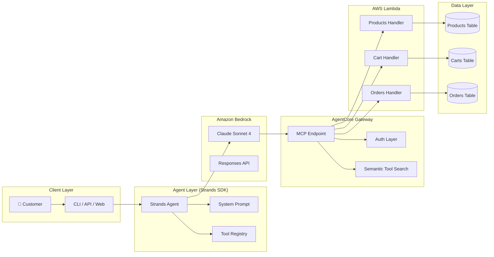
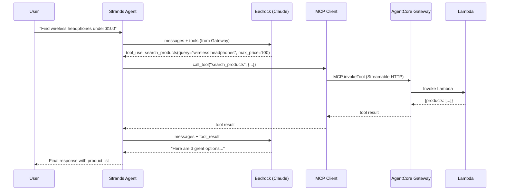
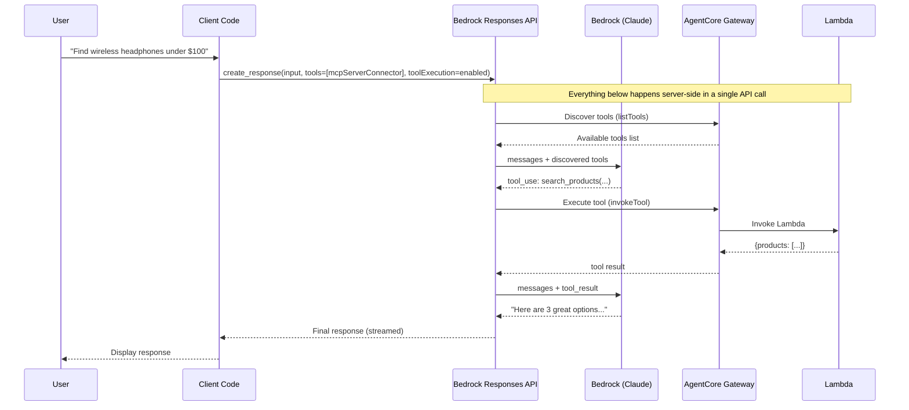
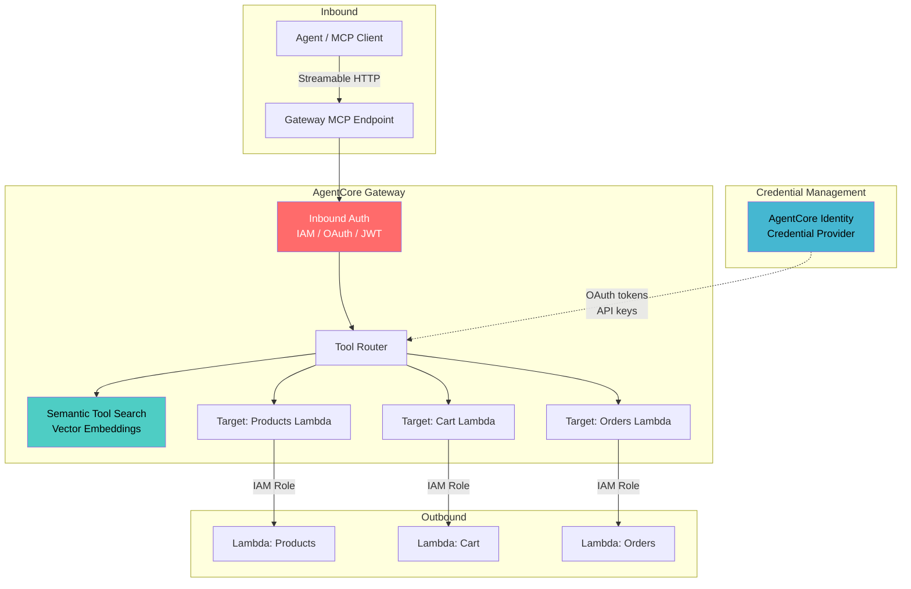

# Architecture — ShopAssist E-Commerce Agent

## High-Level Architecture

## Client-Side vs Server-Side Tool Execution

### Client-Side Execution Flow

### Server-Side Execution Flow

## AgentCore Gateway Architecture

## Data Model

### Products Table
| Field | Type | Description |
|-------|------|-------------|
| id | S (PK) | Product ID (e.g., ELEC-001) |
| category | S (GSI) | Product category |
| name | S | Product name |
| description | S | Full description |
| price | N | Price in USD |
| rating | N | Average rating (1-5) |
| reviews | N | Number of reviews |
| in_stock | BOOL | Availability |

### Carts Table
| Field | Type | Description |
|-------|------|-------------|
| customer_id | S (PK) | Customer ID |
| items | L | List of {product_id, quantity, price} |
| applied_coupon | S | Active coupon code |
| ttl | N | Auto-expire after 24h |

### Orders Table
| Field | Type | Description |
|-------|------|-------------|
| order_id | S (PK) | Order ID |
| customer_id | S (GSI) | Customer ID |
| items | L | Ordered items |
| total | N | Order total |
| status | S | confirmed/shipped/delivered/return_requested |
| created_at | S | ISO timestamp |

## Key Design Decisions

1. **Local-first**: Demo works without AWS deployment using in-memory mock data
2. **Dual-mode**: Supports both client-side and server-side tool execution to demonstrate the difference
3. **MCP-native**: All tools exposed via MCP protocol through AgentCore Gateway
4. **Stateless Lambda**: Cart/order state in DynamoDB, Lambda functions are stateless
5. **Semantic search ready**: Gateway's built-in semantic tool search works with large tool collections (100+)
